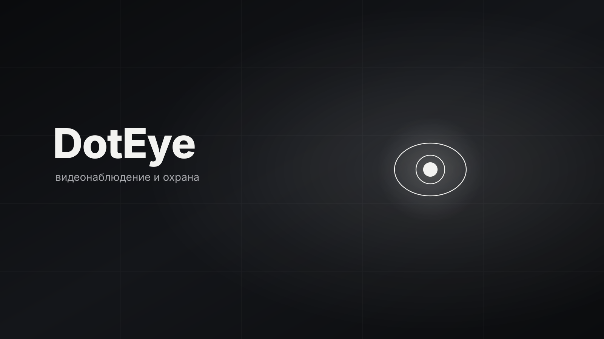

# .ядро

<p>
  
  
  
  <!-- loc:start --><!-- loc:end -->
</p>



DotEye - Telegram-бот, который определяет, кто зашёл в комнату. Подключает вебку ноутбука, IP-камеру или телефон, детектирует людей через YOLO и шлёт уведомления в чат. Вся настройка ведётся прямо внутри Telegram. Два режима: детекция присутствия и распознавание лиц (identity).

## Запуск

```bash
python -m venv .venv
.venv\Scripts\activate            # Windows
pip install -r requirements.txt

cp .env.example .env              # заполни DOTEYE_BOT_TOKEN и остальное
python -m doteye.crypto           # сгенерировать DOTEYE_CRYPTO_KEY

python -m doteye.main
```

Для разработки и тестов:

```bash
pip install -r requirements-dev.txt   # тянет runtime + pytest
python -m pytest tests -q
python bench.py                        # бенчмарк детектора
```

## Команды бота (в чате Telegram)

Доступ - только для id из `DOTEYE_ADMIN_IDS` (пусто = всем, dev-режим).
При старте бот сам присылает админам уведомление с текущими настройками и кнопкой панели.

| Команда | Назначение |
|---------|-----------|
| `/panel` | админ-панель на inline-кнопках |
| `/start` | приветствие |
| `/status` | текущие настройки |
| `/mode` | переключить presence / identity |
| `/camera` | задать источник (0 = вебка, rtsp/http) |
| `/detector` | бэкенд: auto / yolo / yunet / motion |
| `/device` | устройство: cpu / cuda / mps |
| `/model` | выбрать YOLO-модель (с описанием мощности) |
| `/confidence` | порог детекции 0..1 |
| `/cooldown` | пауза между уведомлениями, сек |
| `/people` | список известных людей |
| `/add` | добавить человека (имя + фото лица) |
| `/remove` | удалить человека по имени |
| `/events` | последние события с кадрами |
| `/help` | справка |

## Админ-панель

`/panel` открывает inline-панель: статус, переключение режима и детектора,
выбор YOLO-модели, превью камеры, люди и события. Кнопки меняют настройки
через `runtime.py`, пайплайн подхватывает их на следующем кадре.

Выбор модели (`/model` или кнопка «YOLO-модель») показывает карточки:
размер весов, число параметров, примерная скорость и точность, для чего
модель подходит. Смена модели переключает детектор на `yolo` и пересобирает
его на ходу, без перезапуска процесса.

| Модель | Размер | Параметры | Скорость (CPU) | Точность | Когда брать |
|--------|--------|-----------|----------------|----------|-------------|
| YOLOv8n | ~6 МБ | 3.2M | высокая | базовая | слабое железо, Raspberry Pi |
| YOLOv8s | ~22 МБ | 11.2M | средняя | хорошая | ноутбук без GPU |
| YOLOv8m | ~50 МБ | 25.9M | низкая | высокая | ПК с GPU |
| YOLOv8l | ~84 МБ | 43.7M | очень низкая | очень высокая | сервер/GPU |
| YOLOv8x | ~131 МБ | 68.2M | минимальная | максимальная | максимум точности на GPU |

Каждая следующая модель крупнее, точнее и медленнее. На CPU бери n/s, с GPU - m и выше.

## Стек

<p>
  
  
  
  
  
  
  
</p>

## Архитектура

Бот и пайплайн обработки работают в одном процессе. Telegram-часть на aiogram 3 (async), а OpenCV/YOLO - CPU-bound операции, вынесенные в отдельный поток через `asyncio.to_thread`. События пайплайна попадают в `asyncio.Queue`, откуда их разбирает `send_notifications()` и рассылает админам фото + подпись.

```
doteye/
├── main.py        точка входа: собирает пайплайн + бота, очередь, shutdown
├── config.py      Settings из env-переменных, дефолты, .env
├── runtime.py     настройки env + переопределения из чата (Storage)
├── models.py      каталог YOLO-моделей с описаниями для панели
├── bot.py         aiogram 3: роутер, FSM-диалоги, админ-панель, уведомления
├── camera.py      источники кадров: вебка / RTSP / HTTP-MJPEG (фабрика)
├── detector.py    детекция: yolo | yunet | motion (auto-деградация), remote-заглушка
├── recognizer.py  лицо -> embedding (insightface) + DummyRecognizer fallback
├── crypto.py      AES-256-GCM для кадров, embeddings, remote-передачи
├── pipeline.py    цикл: камера -> детекция -> событие, пересборка, кулдаун
└── storage.py     SQLite (thread-safe): people, events, settings
tests/             pytest: crypto, storage, pipeline, detector, models, bot
bench.py           бенчмарк детектора: FPS и время инференса
run.py             альтернативная точка входа
```

Поток данных:

```
камера (camera.py)
   │  кадр BGR
   ▼
детектор (detector.py)  ── yolo / yunet / motion
   │  боксы людей
   ▼
(identity) recognizer.py ── embedding -> сравнение с people
   │
   ▼
pipeline.py ── кулдаун на человека -> JPEG -> AES-GCM -> storage.add_event
   │
   ▼
asyncio.Queue -> main.send_notifications -> Telegram (фото + подпись)
```

Инварианты:

- Единственный источник правды - `Settings` (env) + `Runtime` (переопределения из чата поверх env).
- Кадры и embeddings хранятся только зашифрованными (AES-256-GCM), ключ в `DOTEYE_CRYPTO_KEY`.
- Хранение - SQLite без ORM, схема в `storage.py`, соединение thread-safe (`check_same_thread=False` + lock).
- Детекция и распознавание - отдельные слои; смена YOLO/insightface не трогает пайплайн.
- Детектор деградирует автоматически: yolo -> yunet -> motion, если зависимость/модель недоступны.
- Кулдаун событий - на каждого человека отдельно (`unknown` в presence), не на всю сцену.

## Тесты

```bash
pip install -r requirements-dev.txt
python -m pytest tests -q
```

Покрыты `crypto`, `storage` (включая миграцию схемы), `pipeline`
(событие, кулдаун, распознавание, пересборка при смене модели/устройства),
каталог моделей, фабрика детекторов и бот (панель, доступ, callback-хендлеры).

## Бенчмарк

```bash
python bench.py                                  # текущий/auto бэкенд
python bench.py --backend yolo --model yolov8n.pt
```

Печатает среднее время инференса, FPS и p95 на синтетических кадрах -
помогает подобрать модель под железо.

## План работ

MVP собран и работает. Дальше по порядку:

- [x] **Уведомления** - события уходят из пайплайна в `asyncio.Queue`, `send_notifications()` шлёт фото + подпись админам.
- [x] **Настройки на ходу** - `/mode`, `/camera`, `/detector`, `/device`, `/confidence`, `/cooldown` пишут в Storage; пайплайн читает через `Runtime` и пересобирает камеру/детектор.
- [x] **Админ-панель** - `/panel` на inline-кнопках: статус, режим, детектор, устройство, выбор модели, превью, люди, события; уведомление о старте бота.
- [x] **Выбор YOLO-модели** - каталог `models.py` с описанием мощности; смена модели пересобирает детектор на ходу.
- [x] **Identity mode** - insightface `buffalo_l` за опциональной зависимостью, регистрация по фото (`/add`) и хранение embeddings.
- [x] **Просмотр событий** - `/events` расшифровывает кадры и отправляет фото.
- [x] **Тесты** - pytest: crypto, storage, pipeline, detector, models, bot.
- [x] **Бенчмарк** - `bench.py` меряет FPS и время инференса.
- [x] **Дедупликация** - кулдаун считается отдельно на каждого (имя в identity, иначе `unknown`), известный не блокирует событие другого.
- [ ] **Remote-инференс** - `RemoteDetector.detect` бросает `NotImplementedError`; реализовать HTTP-транспорт поверх `Crypto`.
- [ ] **Деплой** - Dockerfile для слабого железа (Raspberry Pi) + systemd.

## Лицензия

© 2026 .ядро. Все права защищены.

Проприетарный код. Использование, копирование, изменение и распространение запрещены без письменного разрешения автора. Исходный код открыт только для ознакомления. См. [LICENSE](LICENSE).
